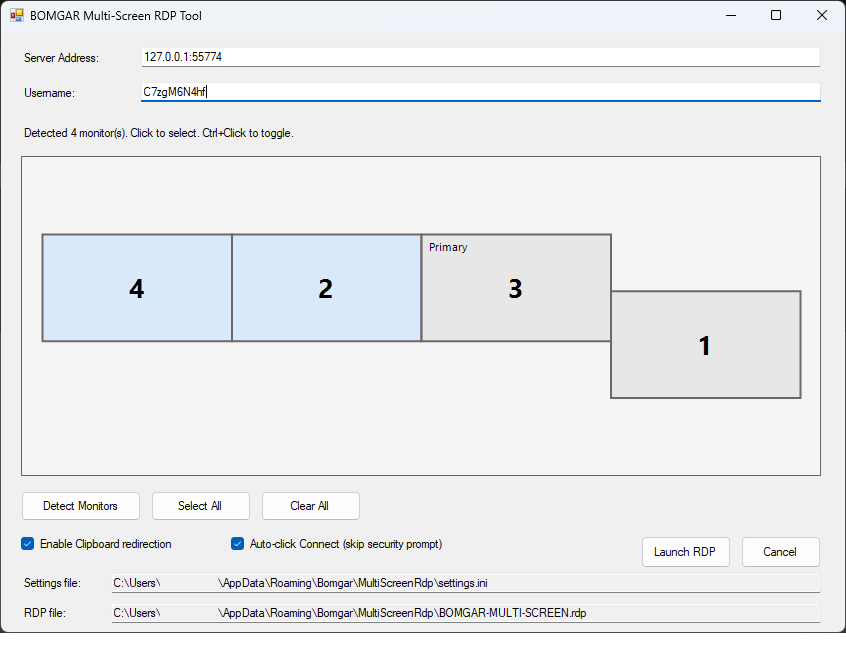

# BOMGAR Multi-Screen RDP Tool

A small Windows utility for launching multi-monitor RDP sessions to Bomgar-managed
targets without manually clicking through the RDP security prompt every time.



## Features

- Detects connected monitors and lets you pick which ones the remote session should
  span, with a click-to-select / Ctrl+click-to-toggle preview
- Remembers your monitor selection and clipboard preference between runs
  (`settings.ini`)
- Writes a standard `.rdp` file (`administrative session`, `use multimon`,
  `selectedmonitors`, clipboard redirection) and launches it via `mstsc.exe`
- **Auto-click Connect**: optionally skips the manual click through the RDP
  security/resource prompt by driving it with UI Automation - waits for the
  `mstsc` dialog, ticks "Don't ask me again for connections to this computer"
  and "Clipboard" (if enabled), then invokes Connect

## Usage

1. Run `BomgarMultiScreenRDP.exe`
2. Enter the server address and username, or leave both blank to relaunch the
   last-used `.rdp` file
3. Click monitors in the preview to select which ones to span (Ctrl+click to
   multi-select), or use **Select All** / **Clear All**
4. Toggle **Enable Clipboard redirection** and **Auto-click Connect** as needed
5. **Launch RDP**

Settings and the generated `.rdp` file are stored under
`%APPDATA%\Bomgar\MultiScreenRdp\`.

## Building from source

The project targets .NET Framework 4.8 and builds with the MSBuild that ships
with Windows - no Visual Studio required (the .NET Framework 4.8 Developer Pack
is needed for the reference assemblies if you don't already have it):

```
& "C:\WINDOWS\Microsoft.NET\Framework64\v4.0.30319\MSBuild.exe" "src\BomgarMultiScreenRDP.csproj" /p:Configuration=Release
```

The built exe is written to `src\bin\Release\BomgarMultiScreenRDP.exe`.

## Credits

The auto-click-through-the-security-prompt approach is adapted from
[dbak91/RdpOneClick](https://github.com/dbak91/RdpOneClick), which uses the same
UI Automation technique to drive the `mstsc.exe` connection dialog.
